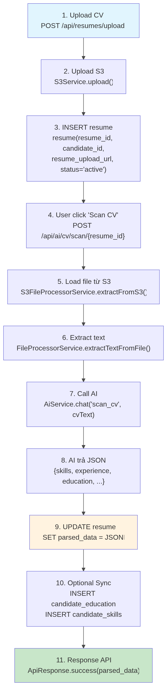
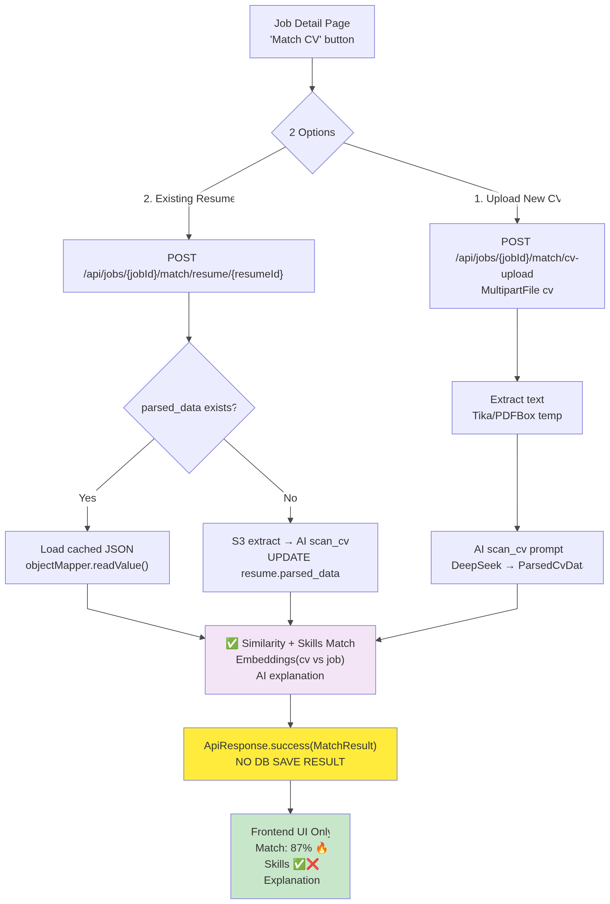

## Scan when upload CV



```bash
flowchart TD
    A["1. Upload CV<br/>POST /api/resumes/upload"] --> B["2. Upload S3<br/>S3Service.upload()"]
    B --> C["3. INSERT resume<br/>resume(resume_id, candidate_id,<br/>resume_upload_url, status='active')"]
    C --> D["4. User click 'Scan CV'<br/>POST /api/ai/cv/scan/{resume_id}"]
    D --> E["5. Load file từ S3<br/>S3FileProcessorService.extractFromS3()"]
    E --> F["6. Extract text<br/>FileProcessorService.extractTextFromFile()"]
    F --> G["7. Call AI<br/>AiService.chat('scan_cv', cvText)"]
    G --> H["8. AI trả JSON<br/>{skills, experience, education, ...}"]
    H --> I["9. UPDATE resume<br/>SET parsed_data = JSONB"]
    I --> J["10. Optional Sync<br/>INSERT candidate_education<br/>INSERT candidate_skills"]
    J --> K["11. Response API<br/>ApiResponse.success(parsed_data)"]

    style A fill:#e1f5fe
    style K fill:#c8e6c9
    style I fill:#fff3e0
```

## Scan when check Match at JobDetail



```bash
flowchart TD
    A["Job Detail Page<br/>'Match CV' button"] --> B{"2 Options"}
    
    B -->|1. Upload New CV| C["POST /api/jobs/{jobId}/match/cv-upload<br/>MultipartFile cv"]
    B -->|2. Existing Resume| D["POST /api/jobs/{jobId}/match/resume/{resumeId}"]
    
    C --> E["Extract text<br/>Tika/PDFBox temp"]
    D --> F{"parsed_data exists?"}
    F -->|Yes| G["Load cached JSON<br/>objectMapper.readValue()"]
    F -->|No| H["S3 extract → AI scan_cv<br/>UPDATE resume.parsed_data"]
    
    E --> I["AI scan_cv prompt<br/>DeepSeek → ParsedCvData"]
    G --> J["Match Engine"]
    H --> J["Match Engine"]
    I --> J["Match Engine"]
    
    J["✅ Similarity + Skills Match<br/>Embeddings(cv vs job)<br/>AI explanation"] --> K["ApiResponse.success(MatchResult)<br/>NO DB SAVE RESULT"]
    
    K --> L["Frontend UI Only<br/>Match: 87% 🔥<br/>Skills ✅❌<br/>Explanation"]
    
    style K fill:#ffeb3b
    style L fill:#c8e6c9
    style J fill:#f3e5f5
    style B shape:diamond
    style F shape:diamond
```

